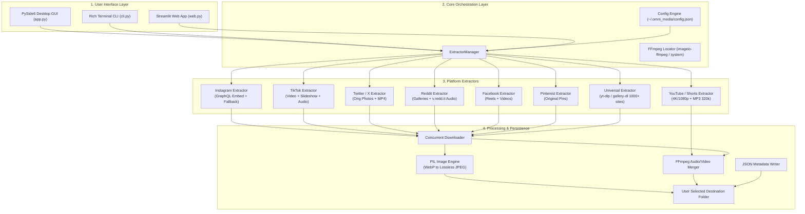
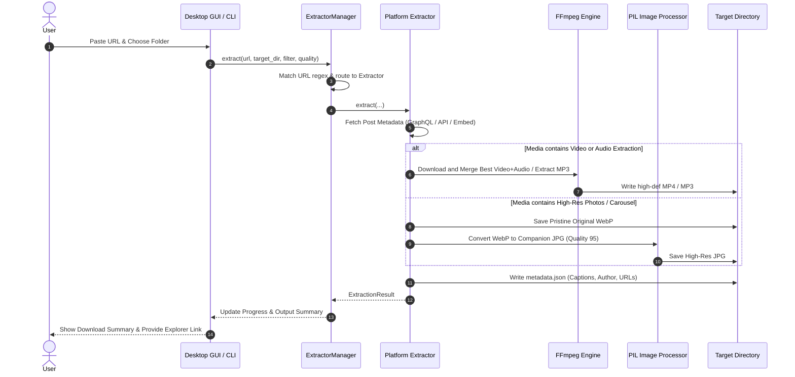

# OmniMedia System Architecture

## 1. Overview
OmniMedia is a modular, extensible media extraction engine designed to fetch high-resolution photos, original carousels, pristine audio streams, and ultra-high-definition videos from social media platforms.

The system is architected into four decoupled layers:
1. **Interface Layer**: Desktop GUI (PySide6 / Qt), Command Line Interface (Click & Rich), and Web Interface (Streamlit).
2. **Orchestration Layer**: `ExtractorManager` responsible for URL parsing, platform routing, and fallback cascading.
3. **Extraction Engine Layer**: Platform-specific extractors implementing `BaseExtractor`.
4. **Processing & Storage Layer**: Stream chunk downloader, FFmpeg remuxing engine, PIL image transformer, and metadata serializer.

---

## 2. High-Level Architecture Diagram

---

## 3. Sequence Flow: Media Extraction Lifecycle

---

## 4. Key Design Decisions

### A. Non-Freezing Desktop GUI
The PySide6 interface offloads heavy network requests and media merging into an asynchronous `QThread` (`ExtractionWorker`). Signals emit progress updates and status strings back to the Qt main thread without GUI stuttering.

### B. Automatic FFmpeg Discovery
FFmpeg is required for combining high-definition video streams (1080p/4K) with separate audio streams and for converting audio to MP3. Rather than requiring users to manually install FFmpeg, OmniMedia resolves:
1. Environment variables (`FFMPEG_BINARY`).
2. System PATH.
3. Bundled Python binaries via `imageio-ffmpeg`.
4. Standard Windows program directories.

### C. Privacy & Strict Git Hygiene
Downloaded media files often contain user data, personal photos, or large multi-gigabyte binaries. The project structure enforces absolute separation between code and media:
- Output folders (`downloads/`, `output/`, `panganidistrictcouncil/`) are strictly ignored in `.gitignore`.
- Binary extensions (`*.jpg`, `*.mp4`, `*.webp`, `*.mp3`) cannot be committed.
- Configuration containing user filepaths is kept in user-local configuration (`~/.omni_media/config.json`).
